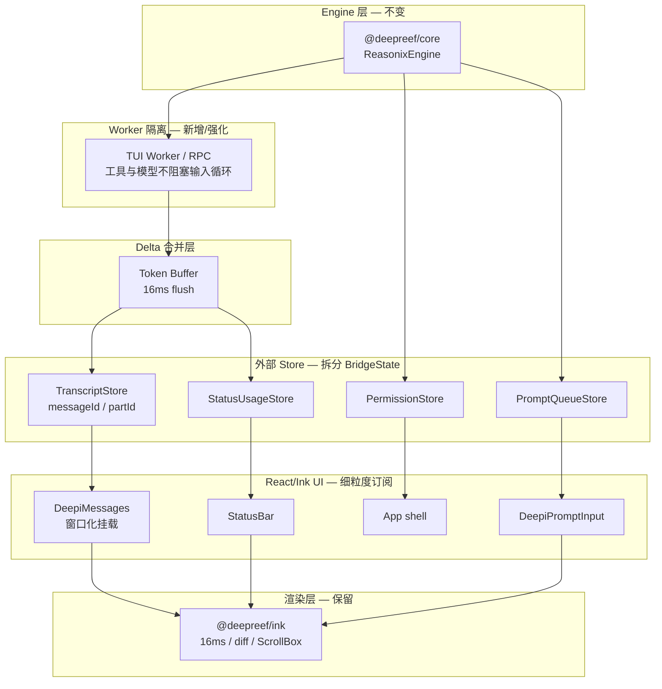

# Deepreef TUI 优化计划

状态：`In Progress`  
最后更新：2026-06-11  
关联文档：[Deepreef后续开发计划.md](Deepreef后续开发计划.md)、[TODO.md](TODO.md)  
参考实现：OpenCode TUI（`/vol4/Agent/opencode/packages/opencode/src/cli/cmd/tui`）

---

## 1. 文档目的

本文是 Deepreef 终端 UI（`packages/tui` + `packages/ink`）的性能与稳定性优化方案，回答：

1. 闪屏、卡顿、快捷键异常等问题的根因在哪里。
2. 哪些能力应借鉴 OpenCode，哪些应保留 Deepreef 自维护 Ink。
3. 分阶段实施顺序、验收指标与明确不做的事项。

**结论（先行）：**

> **保留 Deepreef Ink，不进行 OpenTUI / Solid 整套迁移。**  
> 第一阶段重点复制 OpenCode 的 **Sync Store 规范化**、**逐帧 delta 合并**、**hydration 竞态保护** 与 **运行时隔离**；配合 **默认 Alternate Screen** 与 **帧诊断**，把「基本不闪烁」变成可验证指标。

---

## 2. 现状评估

### 2.1 Ink 底层已经很强（保留，不替换）

`@deepreef/ink` 已具备生产级渲染能力，闪屏不应通过换框架解决：

| 能力 | 位置 | 说明 |
|------|------|------|
| 16ms 帧节流 | `packages/ink/src/core/ink.tsx`（`scheduleRender` / `FRAME_INTERVAL_MS`） | React commit 与终端写入解耦 |
| 屏幕差分 + 双缓冲 | `packages/ink/src/core/renderer.ts`、`screen.ts` | 增量 patch，非每帧全量 |
| 原子终端写入 | `packages/ink/src/core/terminal.ts`（DEC 2026 BSU/ESU） | 支持时避免中间态撕裂 |
| ScrollBox 视口裁剪 + 硬件滚动 | `packages/ink/src/components/ScrollBox.tsx` | DECSTBM 滚动优化 |
| full-reset 原因记录 | `packages/ink/src/core/log-update.ts:504`（`fullResetSequence_CAUSES_FLICKER`） | 可接入诊断 |

主屏（非 Alternate Screen）模式下，scrollback 相关变更会触发 `clearTerminal` 全量重绘，这是**可见闪烁的重要来源**之一，属于渲染模式选择问题，而非 Ink 引擎缺陷。

### 2.2 真正的问题在业务状态层

| 症状 | 根因 | 代码位置 |
|------|------|----------|
| 流式输出时整页抖动 / 闪 | 每个 token 复制整个 `timeline`，触发 App 全树重渲染 | `packages/tui/src/bridge.tsx:105`（`updateTimeline`） |
| 助手回复卡顿 | 每个 `assistant_delta` 更新完整 `BridgeState` | `packages/tui/src/bridge.tsx:321` |
| reasoning 流式额外开销 | `reasoning_delta` 一次事件多次 `setState`（`reasoningActive` + `upsertItem`） | `packages/tui/src/bridge.tsx:363` |
| 时间显示 / key 不稳定 | `startTs: Date.now()` 在每个 delta 重新生成 | `packages/tui/src/bridge.tsx:329` |
| 消息列表全量遍历 | `timeline` 变化时 `map` 重建全部 `MessageBlock` | `packages/tui/src/DeepiMessages.tsx:317` |
| 主屏 full reset 频繁 | 防闪烁全屏模式默认关闭 | `packages/tui/src/fullscreen.ts:1` |
| 流式助手走完整 Markdown | `assistant_text` 未区分 `isStreaming`，每 token 触发 `marked.lexer` | `packages/tui/src/DeepiMessages.tsx:290` |
| 快捷键冲突 / 粘贴异常 | 10+ 组件各自 `useInput`，未用 `KeybindingSetup`；主输入框无 Ctrl+V | `packages/tui/src/DeepiPromptInput.tsx` 等 |

### 2.3 明确不做的事项

| 方案 | 原因 |
|------|------|
| 迁移到 OpenTUI / Solid | 需重写全部 React/Ink 业务组件；废弃已投入 ~2.76 万行的 `@deepreef/ink` fork；Web/PC 复用收益有限 |
| 用 debounce 等「停止输入后再更新」 | 流式场景会明显滞后，违背实时反馈需求 |
| 仅调 Ink 渲染参数 | 无法解决 React 层每 token 全量 commit 的问题 |

OpenTUI 可作为**独立原型**做长会话性能对比，不作为本计划第一阶段范围。

---

## 3. 目标与验收指标

### 3.1 用户体验目标

- 流式输出时：主内容区无明显全屏闪白；光标与底部输入区稳定。
- 长会话（500+ 消息）：滚动与输入仍流畅，帧率不持续低于 20fps。
- Session 恢复与 live 流式并发时：新内容不被陈旧 hydration 覆盖。
- 主输入框：Ctrl+V / bracketed paste 一次生效；弹窗打开时底层快捷键不穿透。

### 3.2 可量化指标（接入帧诊断后持续采集）

| 指标 | 目标（TTY + Alternate Screen + 主流终端） | 采集方式 |
|------|------------------------------------------|----------|
| `full_reset` 次数 / 分钟（流式中） | < 1（resize 除外） | `onFrame` → `flickers[].reason` |
| 帧耗时 p95 | < 20ms | `FrameEvent.durationMs` |
| 每帧 stdout 写入字节 p95 | < 32KB（随终端宽度浮动） | `optimize(diff)` 后统计 |
| 每个 token 触发的 React commit 数 | 1（合并后） | 自定义 counter / React Profiler |
| 流式阶段 Markdown 解析次数 / token | 0（仅 final 后解析） | 单元测试 + 埋点 |

---

## 4. 架构目标（优化后）



---

## 5. 分阶段实施计划

### 阶段 0：快速止血（1–2 天）

不改动架构，先验证渲染模式与流式渲染路径。

| 任务 | 改动 | 文件 |
|------|------|------|
| 0.1 默认启用 Alternate Screen | TTY 下默认 `isFullscreenEnvEnabled() === true`；`DEEPCODE_NO_FLICKER=0` 显式关闭 | `packages/tui/src/fullscreen.ts` |
| 0.2 流式助手改用轻量渲染 | `assistant_text` 在 `isStreaming` 时用 `StreamingCard`，final 后再 `Markdown` | `packages/tui/src/DeepiMessages.tsx` |
| 0.3 固定 `startTs` | round 开始时写入一次，delta 不刷新 | `packages/tui/src/bridge.tsx` |
| 0.4 粘贴与 Ctrl 兜底 | 抽 `tryReadClipboard`；处理 `isPasted` + Ctrl+V；未处理 Ctrl 组合不插入字符 | `packages/tui/src/DeepiPromptInput.tsx`（新建 `clipboard.ts`） |
| 0.5 多行粘贴折叠显示 | ≥3 行或 >150 字符时显示 `[粘贴 +N 行]`，提交时展开全文；借鉴 OpenCode `pasteText` + `expandTrackedPastedText` | `packages/tui/src/prompt-paste.ts`、`DeepiPromptInput.tsx` |

**OpenCode 参考：** `packages/opencode/src/cli/cmd/tui/component/prompt/index.tsx:1314-1319`（阈值与 `[Pasted ~N lines]` 占位符）、`component/prompt/part.ts`（提交前展开）。

**Deepreef 行为：**

- 显示：`[粘贴 +70 行]`（i18n：`pasteSummary`）
- 存储：`TrackedPaste { marker, text, start, end }` 跟踪占位符区间
- 提交：`expandTrackedPastes(input, parts)` 还原完整内容发给 engine
- 关闭折叠：`DEEPCODE_PASTE_SUMMARY=0`

**验收：** 本地 Ghostty/iTerm 流式对话，肉眼闪屏显著减少；Ctrl+V 一次粘贴成功；粘贴 70 行代码块时输入框只显示一行占位符，Enter 后 engine 收到全文。

---

### 阶段 1：规范化 Sync Store（核心，3–5 天）

借鉴 OpenCode `context/sync.tsx` 的数据模型，用适合 React 的外部 store 实现（推荐 `zustand` + `immer`，或轻量自研）。

**OpenCode 参考：**

- Store 结构：`message[sessionID]` + `part[messageID]` 分离
- 更新原语：`produce` + `reconcile` + `Binary.search` 有序插入
- 测试：`opencode/.../sync-live-hydration.test.tsx`

**Deepreef 目标结构：**

```typescript
/** 按 session → message → part 存储，避免扁平 timeline 全量复制 */
interface TranscriptStore {
  sessions: Record<string, {
    messages: MessageMeta[]           // 有序 id 列表
    parts: Record<string, Part[]>     // messageId → parts
    streaming: Record<string, PartRef> // 当前流式 part 指针
  }>
}

type Part =
  | { id: string; type: 'text'; text: string; streaming: boolean }
  | { id: string; type: 'reasoning'; text: string; streaming: boolean }
  | { id: string; type: 'tool'; tool: ToolStatus }
  | { id: string; type: 'user'; content: string }
```

| 任务 | 说明 |
|------|------|
| 1.1 新建 `@deepreef/tui-store` 或 `packages/tui/src/store/` | 与 `bridge.tsx` 解耦 |
| 1.2 `appendPartDelta(partId, chunk)` | O(1) 追加，不复制数组 |
| 1.3 `finalizePart(partId)` | 标记 streaming=false，触发一次 Markdown 解析 |
| 1.4 组件 `useSyncExternalStore` / zustand selector | 只订阅当前 session 最近 N 条消息 |
| 1.5 废弃 `TimelineItem[]` 扁平结构 | `bridge.tsx` 改为 store adapter |

**验收：** 流式 1000 token 时，store 更新不触发 `timeline` 数组整体替换；React Profiler 显示仅消息组件 commit。

---

### 阶段 2：逐帧 Delta 合并（1–2 天）

与 Ink 16ms 帧节流对齐，**不是 debounce**。

```typescript
/** 伪代码 — 每帧最多 flush 一次 */
const tokenBuffer = new Map<PartId, string>()

function onAssistantDelta(partId: string, chunk: string) {
  tokenBuffer.set(partId, (tokenBuffer.get(partId) ?? '') + chunk)
  scheduleFlush() // requestAnimationFrame 或 16ms timer，leading + trailing
}

function flush() {
  for (const [partId, text] of tokenBuffer) {
    store.appendPartDelta(partId, text)
  }
  tokenBuffer.clear()
}

// 以下事件立即提交，不走 buffer：
// assistant_final, tool_*, permission, question, error, done
```

| 任务 | 文件 |
|------|------|
| 2.1 实现 `DeltaBatcher`（16ms） | `packages/tui/src/delta-batcher.ts` |
| 2.2 bridge 事件分类：immediate vs batched | `packages/tui/src/bridge.tsx` |
| 2.3 reasoning_delta 合并为单次 store 更新 | 同上 |

**验收：** 高频 token 下每秒 store 更新 ≤ 60 次；final 事件零延迟呈现。

---

### 阶段 3：拆分 BridgeState（2–3 天）

将单一 `useState<BridgeState>` 拆为独立 store，避免流式文本导致 StatusBar / Prompt 重渲染。

| Store | 内容 | 订阅方 |
|-------|------|--------|
| `TranscriptStore` | 消息与 part | `DeepiMessages` |
| `StatusUsageStore` | tokens、context、isLoading、reasoningActive | `StatusBar` |
| `PermissionQuestionStore` | permissionPrompt、questionPrompt | `PermissionPrompt`、覆盖层 |
| `PromptQueueStore` | messageQueue、pendingInstructionCount | `DeepiPromptInput` |
| `TuiChromeStore` | 各 modal 开关、activeModel 等 | `App` 覆盖层逻辑 |

`App.tsx` 不再持有巨型 `bridgeState`；各子组件细粒度订阅。

**验收：** 流式输出时 `StatusBar` commit 次数 ≈ 0（无 usage 事件时）；`DeepiPromptInput` 不因 token 重渲染。

---

### 阶段 4：Hydration 竞态保护（2 天）

复制 OpenCode `sync-live-hydration` 测试场景并适配 Deepreef。

**竞态场景：**

1. 用户打开已有 session，后台发起 `SessionLoader` / hydration 拉取历史消息。
2. 同时用户发送新 prompt，live `assistant_delta` 开始到达。
3. 若 hydration 响应晚于 live 事件，**陈旧空 part 不得覆盖已有流式内容**。

| 任务 | 说明 |
|------|------|
| 4.1 为每个 part 维护 `revision` 或 `updatedAt` | live 事件单调递增 |
| 4.2 hydration merge 规则：仅当 `remote.revision > local.revision` 时覆盖 | 参考 OpenCode reconcile |
| 4.3 移植测试 | `packages/tui/__tests__/sync-live-hydration.test.tsx`（借鉴 opencode 用例） |

**参考测试：** `opencode/packages/opencode/test/cli/cmd/tui/sync-live-hydration.test.tsx:37`

**验收：** 竞态测试绿灯；手动「恢复 session + 立即提问」不丢字。

---

### 阶段 5：帧诊断与可观测性（1–2 天）

接入 Ink 已有 `onFrame` 回调，把「基本不闪烁」变成 CI 可回归指标。

| 任务 | 说明 |
|------|------|
| 5.1 `packages/tui/src/diagnostics/frame-metrics.ts` | 聚合 durationMs、flickers、diff 字节数 |
| 5.2 CLI 环境变量 `DEEPCODE_TUI_METRICS=1` | stderr 周期性输出 p50/p95 |
| 5.3 开发模式 overlay（可选） | StatusBar 角落显示 fps / reset 计数 |
| 5.4 基准测试 | 扩展 `packages/tui/__tests__/virtual-list-bench.test.ts` |

**验收：** 基准场景下自动生成报告 JSON；full_reset 超阈值时 CI 警告。

---

### 阶段 6：快捷键与输入架构（2–3 天，可与阶段 1 并行）

| 任务 | 说明 |
|------|------|
| 6.1 接入 `KeybindingSetup` | `packages/ink/src/keybindings/` |
| 6.2 Context 分层：`Global` / `Prompt` / `Modal` / `Search` | 弹窗 `useRegisterKeybindingContext` |
| 6.3 合并重复绑定 | 如 Ctrl+O 只保留一处 |
| 6.4 Modal 打开时 `useInput({ isActive: false })` 禁用底层 | `DeepiPromptInput`、 `DeepiMessages` |

**验收：** 快捷键单元测试；手动测试弹窗不穿透、粘贴一次成功。

---

## 6. OpenCode 其他可借鉴能力（阶段 7+，本计划不阻塞）

按优先级排列，在 TUI 核心稳定后逐步吸收：

| 优先级 | 能力 | OpenCode 参考 | Deepreef 收益 |
|--------|------|---------------|---------------|
| P1 | TUI 插件槽 + 分层 Keymap | `plugin/slots.tsx`、`keymap.tsx` | Plugin 扩展侧栏/面板 |
| P1 | TUI 与运行时 Worker/RPC 隔离 | SDK + event bus | 工具/模型不阻塞输入与动画 |
| P2 | Session 级快照与消息回退 | `snapshot` 模块 | 不仅单文件 snapshot |
| P2 | 消息窗口化挂载 | 仅渲染最近 N 条 + 虚拟滚动 | 长会话内存与布局稳定 |
| P2 | Permission / Question / 通知统一队列 | `sync` store 中 permission/question | 覆盖层逻辑一致 |
| P3 | 启动主题预热 | theme init | 避免首帧颜色跳变 |
| P3 | 侧栏 / diff viewer / 导出 | 各 route 组件 | 功能对齐，非性能必需 |

---

## 7. 文件改动预估

| 阶段 | 新建 | 主要修改 |
|------|------|----------|
| 0 | `clipboard.ts` | `fullscreen.ts`、`DeepiMessages.tsx`、`bridge.tsx`、`DeepiPromptInput.tsx` |
| 1–3 | `store/*`、`delta-batcher.ts` | `bridge.tsx`、`App.tsx`、`DeepiMessages.tsx` |
| 4 | `__tests__/sync-live-hydration.test.tsx` | `SessionLoader` 集成点、`store/transcript.ts` |
| 5 | `frame-metrics.ts` | `packages/cli/src/tui.ts`（传入 `onFrame`） |
| 6 | `keybindings.json`（可选） | `App.tsx`、各 Modal |

**不改动：** `packages/ink/src/core/*`（除非诊断需要暴露更多 API）。

---

## 8. 风险与缓解

| 风险 | 缓解 |
|------|------|
| Store 迁移期间双写不一致 | 阶段 1 保留 `bridge` adapter，feature flag `DEEPCODE_TUI_STORE=1` |
| 16ms batch 导致极短回复延迟 | final 事件立即 flush buffer |
| Alternate Screen 与 tmux 兼容 | 保留 `DEEPCODE_NO_FLICKER=0` 回退；文档注明 DEC 2026 终端 |
| 测试覆盖不足 | 每阶段必须有单元测试 + 一项手动验收清单 |

---

## 9. 实施顺序总览

```
阶段 0 快速止血
    ↓
阶段 1 Sync Store ──→ 阶段 4 Hydration 竞态
    ↓                      ↓
阶段 2 Delta 合并      阶段 5 帧诊断
    ↓
阶段 3 拆分 BridgeState
    ↓
阶段 6 快捷键架构
    ↓
阶段 7+ OpenCode 能力选择性移植
```

**建议人力分配：** 1 人可串行完成 0→3（约 2 周）；4、5、6 可并行。

---

## 10. 阶段验收清单（Checklist）

### 阶段 0

- [x] TTY 启动默认进入 Alternate Screen（`fullscreen.ts`）
- [x] 流式助手不再每 token 解析 Markdown（`DeepiMessages` → `StreamingCard`）
- [x] `startTs` 在 round 内恒定（`bridge.tsx`）
- [x] 主输入框 Ctrl+V / 粘贴一次成功（`DeepiPromptInput.tsx`）
- [x] 多行粘贴显示 `[粘贴 +N 行]`，提交时展开（`prompt-paste.ts`）

### 阶段 1（部分）

- [x] `TranscriptStore` + `appendPartDelta` / `finalizePart`（`packages/tui/src/store/`）
- [x] `transcriptToTimeline` adapter（结构共享缓存）
- [x] bridge feature flag `DEEPCODE_TUI_STORE=1`
- [x] 组件 `useSyncExternalStore` 细粒度订阅（`TranscriptContext` + `DeepiMessages`）
- [ ] 废弃 `TimelineItem[]` 扁平结构（完全切换 UI 数据源）

### 阶段 2（部分）

- [x] `DeltaBatcher` 16ms 合并 assistant/reasoning delta（`delta-batcher.ts` + `bridge.tsx`）

### 阶段 3（部分）

- [x] `BridgeRuntime` 拆分 status / queue / permission / feedback
- [x] `BridgeStatusBar` / `BridgeDeepiPromptInput` / `BridgeScrollAlerts` 细粒度订阅
- [x] 流式 token 时跳过 `bridgeState` 更新（`DEEPCODE_TUI_STORE=1`）
- [x] `thinkingMode` 移出 `bridgeState`（由 App 独立 `useState` 持有）

### 阶段 1–3（剩余）

- [x] `TranscriptStore` 单元测试覆盖 delta 追加与 finalize
- [ ] React Profiler：流式时 App 不 commit（仅消息组件）
- [ ] `StatusBar` 在纯 token 流时不重渲染（待 Profiler 验证）

### 阶段 4

- [x] `mergeHydration` + `liveTouchedIds` / `entryRevision`
- [x] `hydration-merge.ts` 合并规则（空 remote 不覆盖非空 local）
- [x] `sync-live-hydration.test.ts` 移植核心场景（6 项绿灯）
- [x] `replaceTranscript` 有 live 内容时走 `mergeHydration`（`bridge.tsx`）
- [ ] 手动「恢复 session + 立即提问」验证

### 阶段 5

- [x] `DEEPCODE_TUI_METRICS=1` 输出 p95 帧耗时与 full_reset 计数（`diagnostics/frame-metrics.ts`）
- [ ] 基准报告可存档

### 阶段 6

- [ ] `KeybindingSetup` 接入
- [ ] 弹窗快捷键不穿透
- [ ] 重复绑定清理完毕

---

## 11. 参考代码索引

| 主题 | Deepreef | OpenCode |
|------|----------|----------|
| Bridge / 状态 | `packages/tui/src/bridge.tsx` | `src/cli/cmd/tui/context/sync.tsx` |
| 消息渲染 | `packages/tui/src/DeepiMessages.tsx` | `src/cli/cmd/tui/routes/session/*` |
| 全屏 / 闪屏 | `packages/tui/src/fullscreen.ts` | alt-screen 默认开启 |
| Ink 渲染 | `packages/ink/src/core/ink.tsx` | N/A（OpenTUI） |
| full reset | `packages/ink/src/core/log-update.ts:504` | N/A |
| Hydration 测试 | （待建）`packages/tui/__tests__/sync-live-hydration.test.tsx` | `test/cli/cmd/tui/sync-live-hydration.test.tsx:37` |
| 帧事件 | `packages/ink/src/core/frame.ts`（`FrameEvent`） | N/A |

---

## 12. 修订记录

| 日期 | 说明 |
|------|------|
| 2026-06-11 | 初稿：综合 Ink 底层评估、业务层根因、OpenCode 借鉴意见与对话排查结论 |
| 2026-06-11 | 补充阶段 0.5：多行粘贴折叠占位符（已实现 `prompt-paste.ts`） |
| 2026-06-11 | 完成阶段 0（Alternate Screen / 流式轻量渲染 / 固定 startTs）、阶段 2 DeltaBatcher、阶段 5 帧诊断基础 |
| 2026-06-11 | 阶段 1 基础：`TranscriptStore` + `DEEPCODE_TUI_STORE=1` bridge 适配 |
| 2026-06-11 | 阶段 1.4：`useSyncExternalStore` 接入 DeepiMessages / SearchOverlay |
| 2026-06-11 | 阶段 3 部分：`BridgeRuntime` 拆分 + 连接组件细粒度订阅 |
